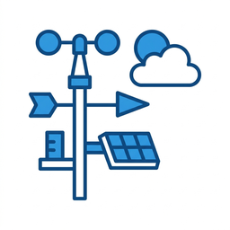

# ioBroker.davis

[](https://www.npmjs.com/package/iobroker.davis)
[](https://www.npmjs.com/package/iobroker.davis)


[](https://nodei.co/npm/iobroker.davis/)

**Tests:** 

## Überblick

Dieser Adapter liest Wetterdaten einer **Davis WeatherLink Live 6100 (WLL)** über deren lokale HTTP-API im Heimnetz aus und stellt sie als ioBroker-States bereit. Es wird keine Cloud-Anbindung oder ein Davis-Account benötigt – der Adapter kommuniziert ausschließlich direkt mit dem Gerät im lokalen Netzwerk.

Da unterschiedliche WeatherLink-Live-Stationen mit unterschiedlichen Sensoren/Transmittern ausgestattet sein können (z. B. mit oder ohne Solarstrahlungssensor, mit oder ohne Boden-/Blattfeuchte-Sensor, mit oder ohne Barometer), legt der Adapter Objekte **dynamisch** nur für die Sensoren an, die die jeweilige Station tatsächlich meldet.

### Funktionsumfang

- Auslesen aller Sensordaten über die lokale API (Abfrage-Intervall konfigurierbar)
- Echtzeit-Modus über UDP-Broadcast für Wind- und Regendaten (Aktualisierung alle ca. 2,5 Sekunden)
- Automatische Geräteerkennung im lokalen Netzwerk per mDNS/Bonjour
- Wahlweise metrische (°C, km/h, hPa, mm) oder imperiale (°F, mph, inHg, in) Einheiten
- Geschätzter Bewölkungsgrad und ein vereinfachtes aktuelles Wetter-Icon, abgeleitet aus den vorhandenen Sensordaten

## Voraussetzungen

- Eine Davis WeatherLink Live 6100 (WLL) im selben lokalen Netzwerk wie der ioBroker-Server
- Node.js ≥ 20 (wird von ioBroker selbst vorgegeben)
- Für die automatische Geräteerkennung: UDP-Multicast muss im Netzwerk erlaubt sein (in vielen Firmennetzen/VLANs ist das nicht der Fall – dann die IP-Adresse manuell eintragen)

## Installation & Einrichtung

1. Adapterinstanz `davis.0` über die ioBroker-Admin-Oberfläche anlegen.
2. In der Instanz-Konfiguration entweder:
   - auf **„Find WeatherLink Live 6100"** klicken, um das Gerät automatisch im Netzwerk zu finden (IP-Adresse und Port werden automatisch eingetragen), oder
   - die **IP-Adresse** der WeatherLink Live 6100 manuell eintragen.
3. Optional das **Abfrageintervall** (Standard: 20 Sekunden, Minimum 10 Sekunden gemäß Davis-API) und die gewünschten **Einheiten** (metrisch/imperial) anpassen.
4. Optional den **Echtzeit-Modus** aktivieren, um Wind- und Regendaten deutlich häufiger zu erhalten.
5. Für die Bewölkungs- und Wetter-Icon-Schätzung: Breiten- und Längengrad müssen unter **Hauptseite → Systemeinstellungen** von ioBroker (nicht in der Adapter-Konfiguration selbst) hinterlegt sein.

## Konfiguration

| Einstellung | Beschreibung |
|---|---|
| WeatherLink Live 6100 IP-Adresse | Lokale IP-Adresse des Geräts, z. B. `192.168.1.50` |
| Port | TCP-Port der lokalen API (Standard: 80) |
| „Find WeatherLink Live 6100" | Sucht das Gerät automatisch per mDNS/Bonjour im lokalen Netzwerk |
| Abfrageintervall (Sekunden) | Wie oft die aktuellen Werte per HTTP abgefragt werden (Minimum 10s) |
| Einheiten | Metrisch (°C, km/h, hPa, mm) oder Imperial (°F, mph, inHg, in) |
| Echtzeit-Modus | Aktiviert den UDP-Broadcast für hochfrequente Wind-/Regendaten |
| Dauer des Echtzeit-Broadcasts | Wie lange eine Aktivierung angefordert wird; wird automatisch erneuert |

## Objektstruktur

```
davis.0
├── info
│   └── connection              Verbindungsstatus zur WeatherLink Live 6100
├── sensors
│   ├── tx<N>                   Ein Kanal je ISS-Transmitter (Außensensor)
│   │   ├── temperature, temperatureFrostWarning, temperature{Day,Month,Year,Absolute}{Min,Max}[Time]
│   │   ├── humidity, humidity{Day,Month,Year,Absolute}{Min,Max}[Time]
│   │   ├── dewPoint, dewPointText, dewPoint{Day,Month,Year,Absolute}{Min,Max}[Time], wetBulb, windChill
│   │   ├── heatIndex, heatIndexText, heatIndex{Day,Month,Year,Absolute}{Min,Max}[Time], thwIndex, thswIndex, ...
│   │   ├── windSpeedLast, windSpeedLast{Day,Month,Year,Absolute}{Min,Max}[Time]
│   │   ├── windDirLast, windDirLastText, windDirLastMin5Min, windDirLastMax5Min, windSpeedAvg10Min, windDirAvg10Min, windDirAvg10MinText
│   │   ├── windSpeedHi2Min, windDirHi2Min, windDirHi2MinText, windSpeedHi10Min, windDirHi10Min, windDirHi10MinText
│   │   ├── rainRateLast, rainRateLastText, rainRateHi, rainfall15Min, rainRateHi15Min, rainfall60Min, rainfall24Hr
│   │   ├── rainfallDaily, rainfallMonthly, rainfallYear
│   │   ├── rainStorm, rainStormStartAt, rainStormLast, rainStormLastStartAt, rainStormLastEndAt
│   │   ├── solarRad, solarRad{Day,Month,Year,Absolute}{Min,Max}[Time]                    (nur falls Solarsensor vorhanden)
│   │   ├── uvIndex, uvIndexText, uvIndex{Day,Month,Year,Absolute}{Min,Max}[Time]         (nur falls Solarsensor vorhanden)
│   │   └── lowBattery, receptionState
│   ├── soilLeaf<N>              Ein Kanal je Boden-/Blattfeuchte-Transmitter (falls vorhanden)
│   │   └── soilTemp1-4, soilMoisture1-4, leafWetness1-2, lowBattery
│   ├── barometer                Nur falls ein Barometer-Sensor vorhanden ist
│   │   └── seaLevel, seaLevel{Day,Month,Year,Absolute}{Min,Max}[Time], absolute, trend
│   └── inside                   Nur falls ein Innensensor vorhanden ist
│       └── temperature, temperature{Day,Month,Year,Absolute}{Min,Max}[Time], humidity, humidity{Day,Month,Year,Absolute}{Min,Max}[Time], dewPoint, heatIndex
└── calculated
    ├── cloudCover                Geschätzter Bewölkungsgrad in % (0-100)
    ├── cloudCoverModel           Welches Modell verwendet wurde (siehe unten)
    ├── weatherCode               Numerischer Wettercode (siehe Tabelle unten)
    ├── weatherState              Sprechender Bezeichner des Wetterzustands
    ├── weatherIcon               Pfad zum passenden Wetter-Icon (SVG)
    └── evapotranspiration        Geschätzte Referenz-Verdunstung (ETo) des laufenden Tages in mm/Tag
```

**Wichtig:** Ein Kanal/State wird nur angelegt, wenn die Station den entsprechenden Sensor tatsächlich meldet. Eine Station ohne Solarstrahlungssensor bekommt z. B. keine `solarRad`/`uvIndex`-States, und ohne Barometer entsteht kein `sensors.barometer`-Kanal. Ebenso werden die `calculated.*`-States nur angelegt, wenn genügend Sensordaten für mindestens eine der unten beschriebenen Berechnungsmethoden vorhanden sind.

`windDirLastText`, `windDirAvg10MinText`, `windDirHi2MinText` und `windDirHi10MinText` enthalten die jeweilige Windrichtung als 16-teilige Kompass-Abkürzung (z. B. `N`, `NNO`, `O`, `SSW`, …), abgeleitet aus `windDirLast`/`windDirAvg10Min`/`windDirHi2Min`/`windDirHi10Min` in Grad.

`windDirLastMin5Min` und `windDirLastMax5Min` enthalten die beiden Randwinkel des kleinsten Kreisbogens, der alle Windrichtungs-Messwerte der letzten 5 Minuten umschließt (in Grad) – also die "Auslenkung" der Windrichtung in diesem Zeitraum. Im Uhrzeigersinn von `windDirLastMin5Min` nach `windDirLastMax5Min` (ggf. über 360°/0° hinweg, falls `windDirLastMax5Min` kleinerer Wert als `windDirLastMin5Min` ist) liegen alle beobachteten Richtungen. Die Werte werden bei jedem Poll aus einem laufend mitgeführten, gleitenden 5-Minuten-Fenster der letzten Windrichtungs-Messwerte neu berechnet (nicht erst, nachdem 5 Minuten vergangen sind – schon der erste Messwert ergibt sofort `windDirLastMin5Min = windDirLastMax5Min` = den aktuellen Wert, und der Bogen wächst dann kontinuierlich mit jeder neuen Messung, bis das 5-Minuten-Fenster vollständig gefüllt ist). Ein Beispiel: Werte von 350°, 0° und 10° innerhalb der letzten 5 Minuten ergeben `windDirLastMin5Min = 350` und `windDirLastMax5Min = 10` (ein 20°-Bogen über die 0°/360°-Grenze hinweg, nicht die viel größere 340°-Spanne, die eine naive Min/Max-Berechnung ergeben würde). Dieses Fenster wird rein im Arbeitsspeicher gehalten und beginnt nach einem Adapter-Neustart wieder neu – im Gegensatz zu den Tages-/Monats-/Jahres-/Absolut-Minimal-/Maximalwerten (siehe unten) ist das für einen reinen 5-Minuten-Indikator unproblematisch.

`uvIndexText` enthält die UV-Risikokategorie nach der WHO/WMO-Skala (`Niedrig`, `Mäßig`, `Hoch`, `Sehr hoch`, `Extrem`), abgeleitet aus `uvIndex`.

`rainRateLastText` enthält die Niederschlagsintensität nach der WMO/NWS-Skala (`Kein Niederschlag`, `Leicht`, `Mäßig`, `Stark`, `Sehr stark`), abgeleitet aus `rainRateLast`.

`heatIndexText` enthält die Hitzewarnkategorie nach der NWS-Heat-Index-Skala (`Keine`, `Vorsicht`, `Erhöhte Vorsicht`, `Gefahr`, `Extreme Gefahr`), abgeleitet aus `heatIndex`.

`dewPointText` enthält die Schwüle-/Komfortkategorie nach der NOAA-Taupunkt-Skala (`Trocken`, `Angenehm`, `Schwül`, `Sehr schwül`), abgeleitet aus `dewPoint`.

`temperatureFrostWarning` ist `true`, sobald die aktuelle Temperatur bei oder unter 0 °C liegt (Frost-/Eisbildungsrisiko).

`rainStormStartAt`, `rainStormLastStartAt` und `rainStormLastEndAt` enthalten den jeweiligen Zeitpunkt als ISO-8601-Zeitstempel (z. B. `2026-08-02T00:15:00.000Z`), umgerechnet aus dem von der Station gelieferten UNIX-Zeitstempel.

## Minimal-/Maximalwerte (`<feld>{Day,Month,Year,Absolute}{Min,Max}` / `...Time`)

Für die tatsächlich gemessenen Sensorwerte (Temperatur, Luftfeuchte, Taupunkt, Hitzeindex, Windgeschwindigkeit, Solarstrahlung, UV-Index, Luftdruck – jeweils außen wie innen) werden zusätzlich zum aktuellen Wert automatisch die Minimal- und Maximalwerte für den laufenden Tag, den laufenden Monat, das laufende Jahr sowie seit Installation des Adapters ("Absolute") mitgeführt. Für jede dieser acht Kombinationen (4 Zeiträume × Min/Max) gibt es zwei States:

- `<feld>DayMin`, `<feld>MonthMin`, `<feld>YearMin`, `<feld>AbsoluteMin` (und analog `...Max`) – der jeweilige Extremwert, in der aktuell eingestellten Anzeigeeinheit.
- `<feld>DayMinTime`, `<feld>MonthMinTime`, `<feld>YearMinTime`, `<feld>AbsoluteMinTime` (und analog `...MaxTime`) – der Zeitpunkt, zu dem dieser Extremwert gemessen wurde, als ISO-8601-Zeitstempel.

Beispiel: `sensors.tx1.temperatureDayMax` = `28.4` und `sensors.tx1.temperatureDayMaxTime` = `2026-08-02T15:42:00.000Z` bedeutet: Die höchste heute gemessene Temperatur betrug 28,4 °C, gemessen um 15:42 Uhr UTC.

Tag/Monat/Jahr-Buckets setzen sich beim jeweiligen Kalenderwechsel automatisch zurück (lokale Zeit des Systems, auf dem ioBroker läuft); der "Absolute"-Wert wird nie zurückgesetzt und bleibt über Adapter-Neustarts hinweg erhalten (die Werte werden aus den bestehenden States rekonstruiert). **Hinweis:** Da die Werte in der jeweils aktuell eingestellten Anzeigeeinheit gespeichert werden, führt ein nachträglicher Wechsel der Einheit (Metrisch/Imperial) in den Adaptereinstellungen dazu, dass bereits erfasste Extremwerte weiterhin in der zum Zeitpunkt ihrer Messung gültigen Einheit angezeigt werden.

## Verdunstungsschätzung (`calculated.evapotranspiration`)

Aus der heutigen minimalen und maximalen Außentemperatur (siehe oben) sowie dem in den ioBroker-Systemeinstellungen hinterlegten Breitengrad wird mit der vereinfachten Hargreaves-Samani-Gleichung eine Referenz-Verdunstung (ETo, mm/Tag) geschätzt – der in Bewässerungssystemen gängige Kennwert für den Wasserbedarf von Pflanzen. Die Methode kommt ohne Feuchte-, Wind- oder direkte Strahlungsmessung aus und ist damit deutlich einfacher als das vollständige FAO-56-Penman-Monteith-Verfahren, aber auch entsprechend ungenauer (üblicherweise ±15-20 % Abweichung bei Tagessummen). Voraussetzung: Standort (Breiten-/Längengrad) in den ioBroker-Systemeinstellungen hinterlegt **und** mindestens eine Temperaturmessung für den laufenden Tag vorhanden – der Schätzwert wird über den Tag hinweg genauer, je größer die tatsächlich erfasste Temperaturspanne (Tagesminimum/-maximum) wird.

## Bewölkungsgrad-Schätzung (`calculated.cloudCover`)

Da die WeatherLink Live 6100 selbst keinen Bewölkungsgrad liefert, wird er aus den vorhandenen Sensordaten geschätzt. Je nach Ausstattung der Station kommt eines von zwei Modellen zum Einsatz:

1. **Solarstrahlungsbasiert** (`cloudCoverModel = "solar"`): Vergleicht die gemessene Solarstrahlung mit einer Klarhimmel-Referenz für den aktuellen Sonnenstand. Voraussetzung: Solarstrahlungssensor vorhanden **und** Breiten-/Längengrad in den ioBroker-Systemeinstellungen hinterlegt **und** die Sonne steht ausreichend hoch (nicht bei Dämmerung/Nacht).

   Die Klarhimmel-Referenz wird **adaptiv pro Sonnenstand gelernt** (`calculated.clearSkyReference`, intern, Rolling-Fenster 15 Tage): Der Adapter merkt sich je 5°-Sonnenstand-Schritt den höchsten tatsächlich gemessenen Solarstrahlungswert und nutzt diesen als Referenz für „0 % Bewölkung" bei diesem Sonnenstand – das passt sich automatisch an die lokale Atmosphäre (Luftfeuchte, Dunst, Höhenlage) an. Bis für einen bestimmten Sonnenstand genügend eigene Messwerte vorliegen (typischerweise nach einigen wirklich klaren Tagen), verwendet der Adapter übergangsweise die generische Haurwitz-Formel als Startwert; diese kann besonders bei mittlerem Sonnenstand die real erreichbare Einstrahlung überschätzen und dadurch anfangs einen zu hohen Bewölkungsgrad an eigentlich klaren Tagen anzeigen.
2. **Taupunkt-Heuristik** (`cloudCoverModel = "heuristic"` bzw. `"heuristic+pressure"`): Deutlich gröbere Schätzung anhand der Taupunkt-Depression (Differenz zwischen Temperatur und Taupunkt), optional verfeinert durch den 3-Stunden-Drucktrend, falls ein Barometer vorhanden ist. Funktioniert auch nachts oder ohne Solarsensor, ist aber nur ein Trendindikator.

Ist keines der beiden Modelle mit den vorhandenen Sensoren berechenbar, wird `calculated.cloudCover` gar nicht erst angelegt.

## Wetter-Icon (`calculated.weatherIcon`)

Aus dem geschätzten Bewölkungsgrad, der aktuellen Regenrate, der Temperatur und dem Taupunkt wird ein vereinfachtes aktuelles Wetter-Symbol abgeleitet – ähnlich den Wettersymbolen, wie sie z. B. der Deutsche Wetterdienst (DWD) in seinen MOSMIX-Vorhersagen mit dem WMO-„Significant Weather"-Code (`ww`) verwendet. Da eine Wetterstation nur den aktuellen Moment misst (keine Vorhersage), wird eine vereinfachte Auswahl dieser internationalen Code-Kategorien verwendet.

Die Icon-Grafiken sind ein Ausschnitt aus [Meteocons](https://github.com/basmilius/meteocons) von Bas Milius (MIT-Lizenz, siehe `admin/img/weathericons/LICENSE`) und liegen lokal im Adapter – es wird keine externe Bildquelle zur Laufzeit benötigt. `calculated.weatherIcon` enthält den Pfad zur jeweiligen SVG-Datei (z. B. `/adapter/davis/img/weathericons/clear-day.svg`), der direkt in VIS-Widgets verwendet werden kann.

### Bedeutung des numerischen Wettercodes (`calculated.weatherCode`)

| Code | `weatherState` | Bedeutung |
|---|---|---|
| 0 | `clear` | Klar (Bewölkung ≤ 10 %) |
| 1 | `mostlyClear` | Überwiegend klar (Bewölkung ≤ 40 %) |
| 2 | `partlyCloudy` | Teilweise bewölkt (Bewölkung ≤ 70 %) |
| 3 | `cloudy` | Bewölkt (Bewölkung ≤ 90 %) |
| 3 | `overcast` | Bedeckt (Bewölkung > 90 %) |
| 45 | `fog` | Nebel (Taupunkt-Depression ≤ 0,5 °C bei wenig Wind) |
| 51 | `drizzle` | Leichter Niederschlag (Regenrate ≤ 0,5 mm/h) |
| 61 | `rain` | Regen |
| 65 | `heavyRain` | Starker Regen (Regenrate ≥ 4 mm/h) ohne bedeckten Himmel als Gewitterbestätigung |
| 68 | `sleet` | Schneeregen/gefrierender Regen (Regen bei Temperatur zwischen 0 °C und 2 °C) |
| 71 | `snow` | Schnee (Regen bei Temperatur ≤ 0 °C) |
| 75 | `heavySnow` | Starker Schneefall (Regenrate ≥ 2 mm/h bei Temperatur ≤ 0 °C) |
| 95 | `thunderstorm` | Gewitter-Verdacht (starker Regen plus mindestens ein bzw. bei mehreren verfügbaren Signalen mindestens zwei übereinstimmende Indizien: nahezu bedeckter Himmel, Böenfront-Windspitze oder starker Druckabfall) |

Die Codes orientieren sich an der WMO-Tabelle 4677/4680 (dieselbe Klassifikation, die auch DWD-MOSMIX-Daten zugrunde liegt), sind aber auf die aus einer einzelnen Momentaufnahme zuverlässig ableitbaren Kategorien reduziert. Feinere Abstufungen der internationalen Tabelle (z. B. „Gewitter in der letzten Stunde, aktuell vorbei" oder eine sichere Unterscheidung zwischen Schneeregen und gefrierendem Regen) lassen sich aus reinen Stationsmessungen nicht bestimmen. Die Kategorien `cloudy` und `overcast` teilen sich den WMO-Code 3, da die klassische Tabelle dafür keine getrennten Codes vorsieht – zur Unterscheidung dient der `weatherState`-Text bzw. das jeweilige Icon. Bei Niederschlag ohne (nahezu) bedeckten Himmel wird zusätzlich eine „teilweise bewölkt + Niederschlag"-Icon-Variante verwendet, sofern vorhanden.

Die WeatherLink Live 6100 unterstützt (im Gegensatz zur älteren Vantage Pro2/Vue-Serie oder der WeatherLink-Cloud/AirLink) keinen Blitzsensor, Gewitter können daher nie direkt erkannt werden, sondern nur anhand begleitender Indizien vermutet werden: starker Regen plus mindestens ein bestätigendes Signal (nahezu bedeckter Himmel, ein Böenfront-Windsprung zwischen der 2-Minuten-Spitze und dem 10-Minuten-Mittelwind, oder ein starker 3-Stunden-Druckabfall am Barometer). Sind mehrere dieser Signale verfügbar, müssen mindestens zwei übereinstimmen, damit ein einzelnes mehrdeutiges Signal (z. B. nur ein bedeckter Himmel, der auch bei gewöhnlichem Landregen auftritt) nicht allein ausreicht.

`calculated.weatherCode`/`weatherIcon`/`weatherState` werden nur angelegt, wenn mindestens der Bewölkungsgrad **oder** eine aktive Regenmessung vorliegt.

## Einheiten und Regenmengen

Die WeatherLink Live 6100 liefert alle Werte grundsätzlich in imperialen Einheiten (°F, mph, inHg). Bei aktivierter „Metrisch"-Einstellung rechnet der Adapter Temperatur, Windgeschwindigkeit und Luftdruck vor dem Speichern um. Regenwerte werden anhand der vom Gerät gemeldeten Wippengröße (`rain_size`) von rohen Kippzählern in eine physikalische Regenmenge (mm bzw. Zoll) umgerechnet.

## Bekannte Einschränkungen

- Die Bewölkungs- und Wetter-Icon-Schätzung sind **Näherungen**, keine Messungen. Das solarstrahlungsbasierte Modell erreicht üblicherweise ±10–15 % Genauigkeit bei Tageslicht; die Taupunkt-Heuristik ist deutlich gröber und eher als Trendindikator zu verstehen.
- Ohne konfigurierten Standort (Breiten-/Längengrad) in den ioBroker-Systemeinstellungen funktioniert nur die Taupunkt-Heuristik, nicht das genauere solarstrahlungsbasierte Modell.
- Die automatische Geräteerkennung funktioniert nur, wenn UDP-Multicast im lokalen Netzwerk nicht blockiert wird.

## Changelog
### **WORK IN PROGRESS**
* (steinwedel) **CHANGED**: The wind direction spread indicator now exposes the arc's two boundary angles (windDirLastMin5Min/windDirLastMax5Min) instead of a single opening-angle number, so the actual observed direction range can be shown, not just its size
* (steinwedel) **FIXED**: Wind direction range tracking no longer includes readings taken during calm wind, since a vane's direction becomes unreliable noise at near-zero speed and could otherwise make the tracked 5-minute range balloon out to a spurious value (e.g. 0°) the wind never actually blew from

### 0.0.13 (2026-08-02)
* (steinwedel) **NEW**: Rain intensity, frost warning, heat risk and dew point comfort categories, day and month minimum and maximum tracking, an evapotranspiration estimate, and a wind direction spread indicator, derived from existing sensor data

### 0.0.12 (2026-08-01)
* (steinwedel) **CHANGED**: A failed real-time broadcast activation is now only logged as a warning after 3 consecutive failed attempts (transient failures before that are logged at debug level only), since occasional single activation failures against the WeatherLink Live are normal and self-recover on the next retry

### 0.0.11 (2026-07-30)
* (steinwedel) **FIXED**: The solar-based cloud cover model now averages solar radiation readings over a 5-minute window before computing the clear-sky index, instead of using only the single most recent reading. A single brief cloud shadow (well under a minute) could otherwise swing the reported cloud cover by tens of percentage points even though the overall sky condition had not changed (observed e.g. 39% instead of ~0% during a momentary dip). The site-learned clear-sky reference calibration itself is unaffected and still uses the raw (unsmoothed) peak reading.

### 0.0.10 (2026-07-30)
* (steinwedel) **NEW**: Added `wind.svg`, `sleet.svg` and `hail.svg` to the bundled weather icon set (`admin/img/weathericons/`), covering the full Bright Sky/DWD icon vocabulary for external scripts/widgets that reuse these icons

### 0.0.9 (2026-07-30)
* (steinwedel) **NEW**: `sensors.tx<N>.windDirLastText` - current wind direction as a 16-point compass abbreviation (e.g. "N", "NNO", "O", "SSW"), derived from `windDirLast`

### 0.0.8 (2026-07-30)
* (steinwedel) **FIXED**: The solar-based cloud cover model now learns a site-specific clear-sky reference per sun elevation angle (persisted in `calculated.clearSkyReference`) instead of relying solely on the generic Haurwitz formula, which could overestimate the theoretically achievable clear-sky irradiance and thus report cloud cover on genuinely clear days (observed e.g. 14% instead of 0% at 28° sun elevation)

### 0.0.7 (2026-07-30)
* (steinwedel) **CHANGED**: Vollständiger Gerätename "Davis WeatherLink Live 6100" statt nur "Davis WeatherLink Live" in Dokumentation, Admin-UI-Texten und Adapter-Beschreibung verwendet

### 0.0.6 (2026-07-30)
* (steinwedel) **CHANGED**: README komplett überarbeitet: Entwickler-Boilerplate entfernt, echte Nutzerdokumentation (Installation, Konfiguration, Objektstruktur, Bewölkungs-/Wetter-Icon-Modelle, Wettercode-Tabelle) ergänzt

### 0.0.5 (2026-07-30)
* (steinwedel) **CHANGED**: Calculated/derived values (`cloudCover`, `cloudCoverModel`, `weatherCode`, `weatherState`, `weatherIcon`) moved from `sensors.*` into a dedicated `calculated.*` folder, to keep them separate from the raw per-transmitter sensor channels. Existing installations should delete the old `sensors.cloudCover*`/`sensors.weather*` states, as they are no longer updated.

### 0.0.4 (2026-07-30)
* (steinwedel) **NEW**: Simplified current-weather icon (`sensors.weatherCode`, `sensors.weatherState`, `sensors.weatherIcon`) derived from cloud cover, rain rate, temperature and dew point, using a WMO-`ww`-code-inspired classification (in the spirit of DWD's MOSMIX significant weather codes). Icon graphics are a bundled MIT-licensed subset of [Meteocons](https://github.com/basmilius/meteocons) by Bas Milius (see `admin/img/weathericons/LICENSE`). No value is created unless the required sensors/estimates are available.
* (steinwedel) **FIXED**: The dew-point-based cloud cover heuristic now correctly converts temperature/dew point (°F->°C) and the barometric pressure trend (inHg->hPa) before applying its thresholds; previously the raw imperial values were used directly, which skewed the estimate
* (steinwedel) **CHANGED**: Latitude/longitude for the solar-based cloud cover model and day/night icon detection are now taken from ioBroker's system-wide location setting (Admin -> System settings) instead of a separate adapter configuration field

### 0.0.3 (2026-07-30)
* (steinwedel) **NEW**: Estimated cloud cover (`sensors.cloudCover`, `sensors.cloudCoverModel`), using a solar-radiation clear-sky index when a solar sensor and location (latitude/longitude) are configured, falling back to a rougher dew-point-based heuristic (optionally refined with the barometric pressure trend if a barometer is present) otherwise. No value is created if neither model's required sensors are present.

### 0.0.2 (2026-07-29)
* (steinwedel) **NEW**: Initial implementation using the WeatherLink Live Local API (`/v1/current_conditions` polling) with dynamic object creation adapting to the transmitters/sensors actually configured on the station
* (steinwedel) **NEW**: Real-time mode via `/v1/real_time` UDP broadcast (port 22222) for high-frequency wind/rain updates
* (steinwedel) **NEW**: "Find WeatherLink Live" button in the admin UI that discovers the device via mDNS/Bonjour (`_weatherlinklive._tcp.local`) and automatically fills in its IP address and port
* (steinwedel) **NEW**: Configurable unit system (metric °C/km/h/hPa or imperial °F/mph/inHg); the Local API always reports imperial values, which are converted before being stored when "Metric" is selected
* (steinwedel) **NEW**: Rain fields are converted from raw tip counts to a physical rainfall depth (mm/mm per hour when metric, inches/inches per hour when imperial), using the collector's tip size (`rain_size`) reported by the device

### 0.0.1
* (steinwedel) initial release

## License
MIT License

Copyright (c) 2026 steinwedel <steinwedel@example.com>

Permission is hereby granted, free of charge, to any person obtaining a copy
of this software and associated documentation files (the "Software"), to deal
in the Software without restriction, including without limitation the rights
to use, copy, modify, merge, publish, distribute, sublicense, and/or sell
copies of the Software, and to permit persons to whom the Software is
furnished to do so, subject to the following conditions:

The above copyright notice and this permission notice shall be included in all
copies or substantial portions of the Software.

THE SOFTWARE IS PROVIDED "AS IS", WITHOUT WARRANTY OF ANY KIND, EXPRESS OR
IMPLIED, INCLUDING BUT NOT LIMITED TO THE WARRANTIES OF MERCHANTABILITY,
FITNESS FOR A PARTICULAR PURPOSE AND NONINFRINGEMENT. IN NO EVENT SHALL THE
AUTHORS OR COPYRIGHT HOLDERS BE LIABLE FOR ANY CLAIM, DAMAGES OR OTHER
LIABILITY, WHETHER IN AN ACTION OF CONTRACT, TORT OR OTHERWISE, ARISING FROM,
OUT OF OR IN CONNECTION WITH THE SOFTWARE OR THE USE OR OTHER DEALINGS IN THE
SOFTWARE.
